# 🚀 App S9 – Gestión de Preferencias y Perfil de Usuario

**Aplicación Android en Kotlin que permite crear perfiles de usuario, cambiar entre temas claro/oscuro, y gestionar preferencias usando `SharedPreferences`.**

## 📋 Descripción

**App S9** es una aplicación desarrollada en **Kotlin** para Android 14 (API 34), que permite al usuario guardar información de perfil (nombre, edad, email), alternar entre modo claro y oscuro, y llevar un contador de cuántas veces se ha abierto la app. Toda la información se guarda usando `SharedPreferences`.

Cuenta con una interfaz moderna gracias a **Material Design 3**, así como navegación intuitiva entre actividades mediante botones o un menú.

---

## 🎯 Objetivo

Brindar una app funcional, moderna y educativa que demuestre el uso práctico de `SharedPreferences`, Material Design 3, manejo de estado persistente y navegación en Android con Kotlin.

---

## 🚀 Funcionalidades

- 👤 Crear y cargar perfil con nombre, edad y correo electrónico
- 🌓 Alternar entre **modo claro y oscuro** en tiempo real con persistencia
- 🔢 Contador de aperturas de la aplicación
- 🔁 Botón para resetear el contador de aperturas
- ✅ Validación de campos antes de guardar el perfil
- 🧽 Limpieza de campos tras guardar
- 🧭 Navegación entre pantalla principal y pantalla de perfil
- 📱 Interfaz moderna con **Material Design 3**
- 📩 Feedback al usuario mediante `Snackbar`

---

## 🎨 Componentes de Material Design utilizados

- 🟪 **MaterialButton**  
  Botones estilizados para guardar, cargar y navegar entre actividades.  
  `com.google.android.material.button.MaterialButton`

- 🟦 **TextInputLayout + TextInputEditText**  
  Campos para nombre, edad y email con validación visual.  
  `com.google.android.material.textfield.TextInputLayout`  
  `com.google.android.material.textfield.TextInputEditText`

- 🟫 **MaterialCardView**  
  Usado para mostrar resultados o secciones agrupadas con diseño.  
  `com.google.android.material.card.MaterialCardView`

- 🟥 **Snackbar**  
  Mensajes de retroalimentación como “Perfil guardado”, “Contador reiniciado”, etc.  
  `com.google.android.material.snackbar.Snackbar`

- 🟨 **SwitchMaterial**  
  Utilizado para activar o desactivar el **modo oscuro**, con persistencia inmediata.  
  `com.google.android.material.materialswitch.MaterialSwitch`

---

## 🛠️ Tecnologías utilizadas

- **Android Studio Hedgehog o más reciente**
- **Kotlin**
- **API 34 (Android 14)**
- **Material Design 3**
- **SharedPreferences**
- **Snackbar**
- **Multi-Activity navigation**

---

## 🖼️ Capturas de pantalla

### Vista principal Modo Claro
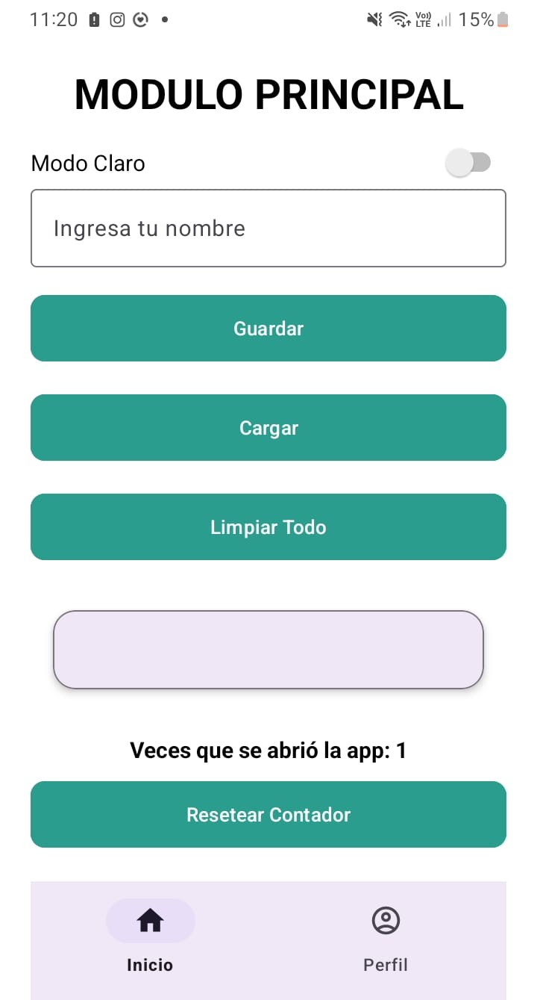

### Vista principal Modo Oscuro
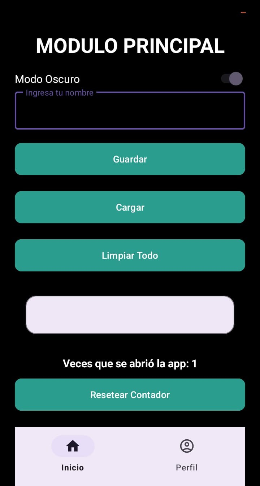

### Motrar Datos Modo Claro Vista Principal
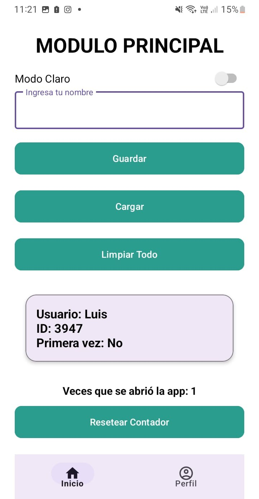

### Motrar Datos Modo Oscuro Vista Principal
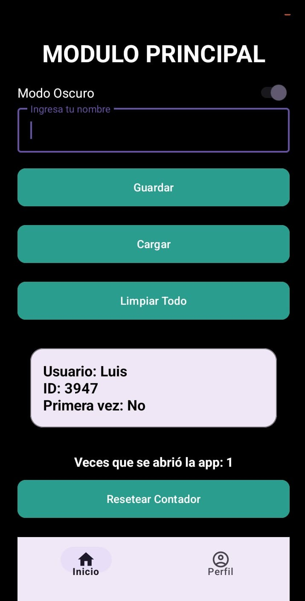

### Guardar datos Vista Principal
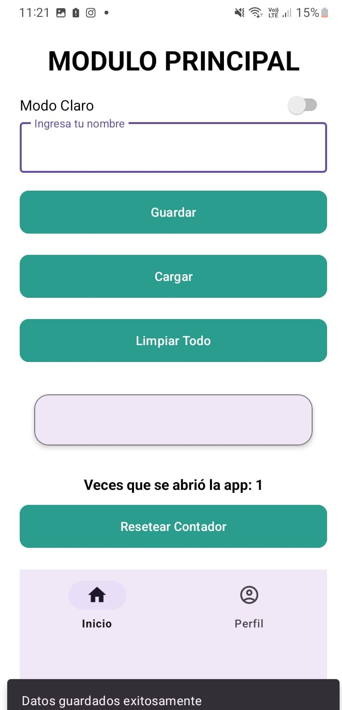

### Contador De Visitas Reiniciador
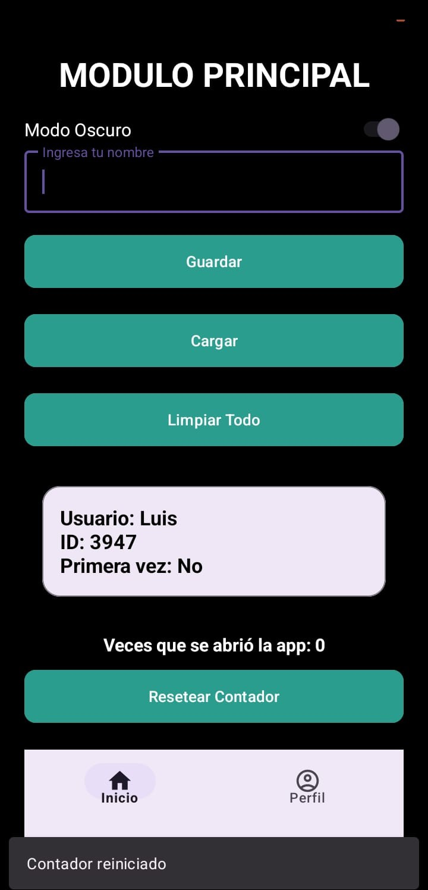

### Vista Crear Perfil Claro
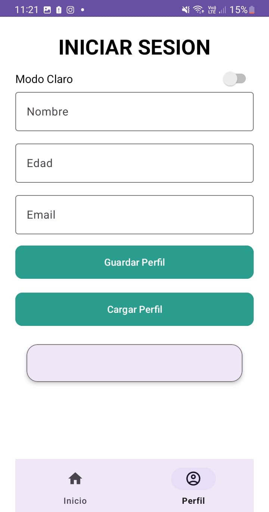

### Vista Crear Perfil Oscuro
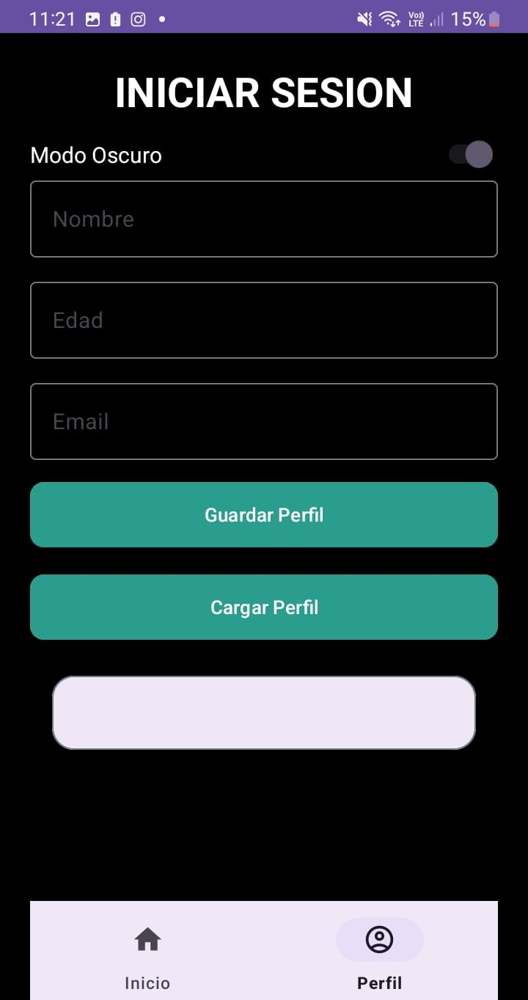

### Perfil Creado
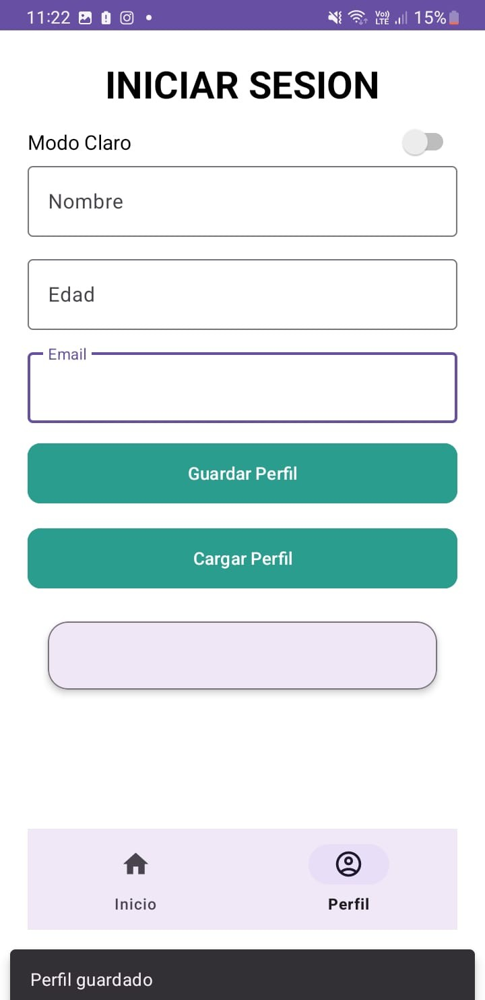

### Mostrar Perfil Claro
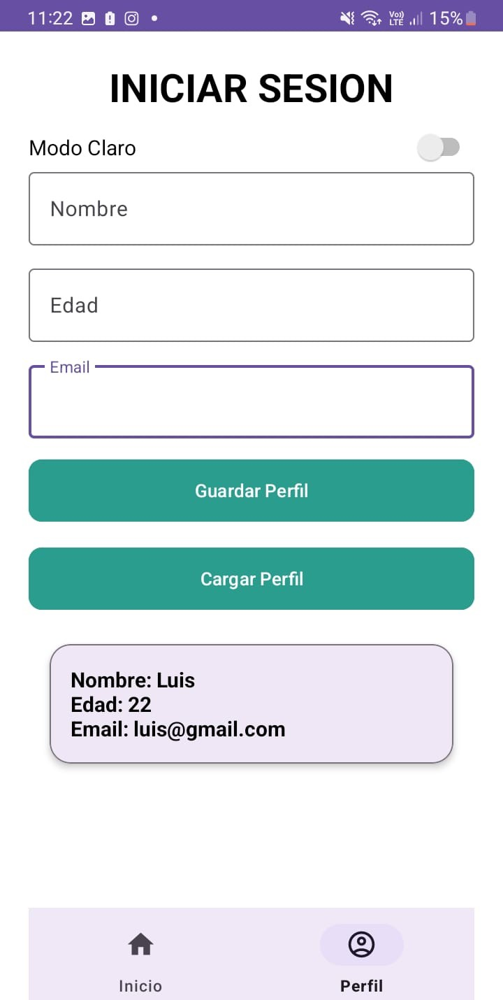

### Mostrar Perfil Oscuro
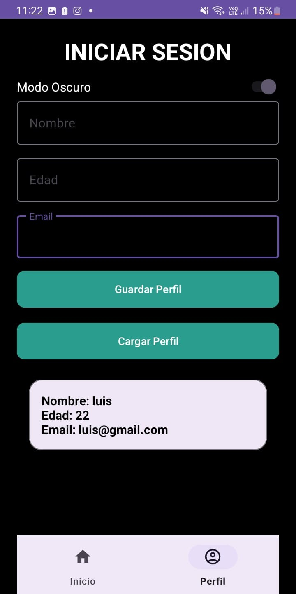

---

## ⚙️ Instalación

1. Clona este repositorio:
   
bash
   git clone https://github.com/usuario/app-san-pedrito.git
2. Ábrelo en Android Studio  
3. Ejecuta el proyecto en un emulador o dispositivo físico con Android 11 o superior

## 👨‍💻 Autor

- **Nombre:** LuxoGB11  
- **Carrera:** Estudiante de Ingeniería de Sistemas e Informática  
- **Universidad:** Universidad Nacional del Santa  
- **GitHub:** [https://github.com/luxo11GB](https://github.com/luxo11GB)

## 📄 Licencia

Este proyecto se distribuye bajo la licencia MIT. Consulta el archivo `LICENSE` para más detalles.
